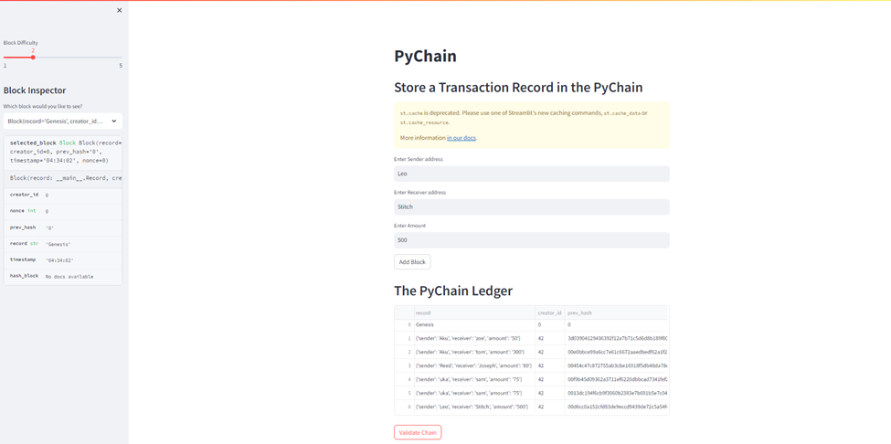

# PyChain

This Streamlit Application emulates a ledger system based on blockchain technology, enabling users to execute financial transactions (sending money from one party to another) and verify the data's integrity within the ledger.
To utilize the application, users are prompted to input a Sender address, Receiver address, and the amount of cryptocurrency they wish to send. The application, named "PyChain Ledger," monitors and stores these transactions. Users have the option to examine each block or transaction by selecting the "Block Inspector" from the left-hand drop-down menu in the application. Additionally, users can assess the Blockchain Ledger System by clicking the "Validate Chain" button, which compares the hash of the current block with the previous block's hash to ensure consistency.
